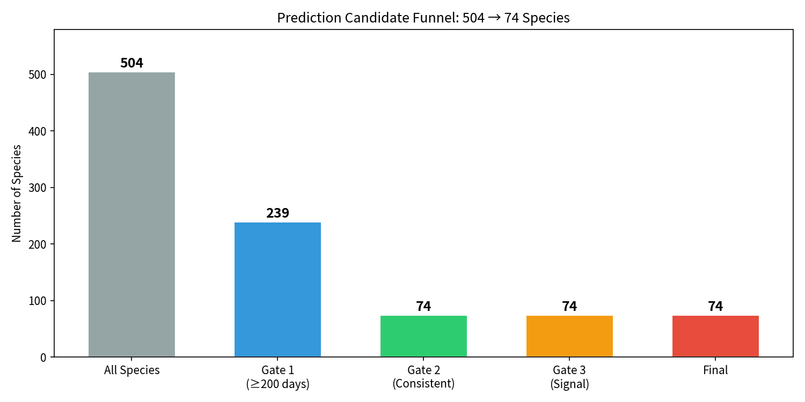
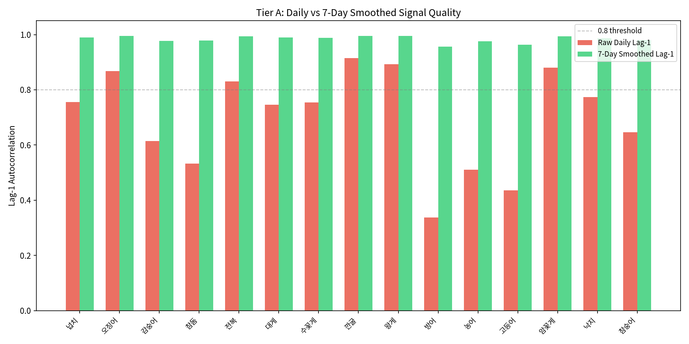
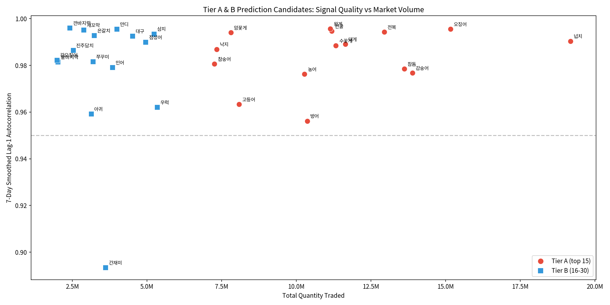
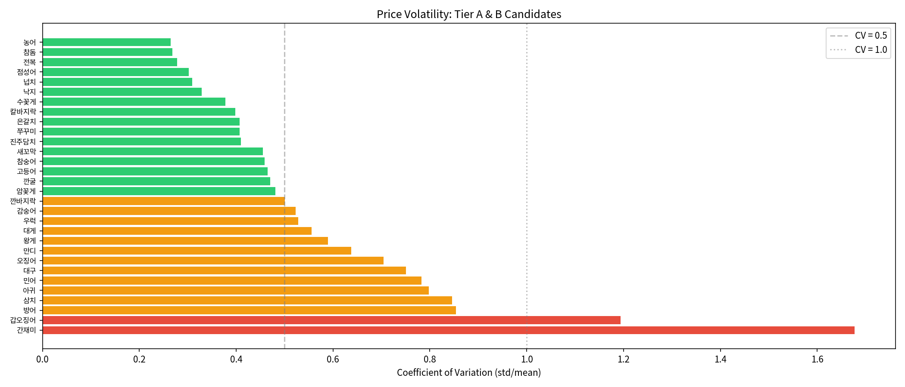

# Prediction Candidate Shortlist

> Generated from `scripts/eda_prediction_candidates.py` on 2026-03-26.
> **Update (2026-03-30):** 20 configs across 15 species are now in production. See `docs/15_prediction_config_registry.md` for the current list.

## Summary

Out of 504 species, **74 survive** a 4-gate filter. From these, **20 prediction configs** across 15 species were selected and tested with models ranging from Naive to TFT (Temporal Fusion Transformer). Best results: 10.2-16.3% MAPE for sashimi species.



### Funnel

| Gate | Criteria | Survivors |
|---|---|---|
| Start | All species | 504 |
| Gate 1: Data Volume | ≥200 distinct trading days | 239 |
| Gate 2: Consistency | Active in last year + ≥60% of recent trading days | 74 |
| Gate 3: Signal Quality | Lag-1 autocorrelation ≥ 0.3 (raw or 7d-smoothed) | 74 |
| Gate 4: Market Relevance | Ranked by total quantity traded, tiered | 74 (15A + 15B + 44C) |

Gate 2 is the biggest filter: **165 species** were eliminated because they either stopped trading or appear too sporadically (e.g., seasonal species that show up < 60% of trading days).

Gate 3 passed all 74 remaining — once a species trades consistently, its price series has at least some autocorrelation.

---

## Tier A: Top 15 Candidates (recommended for v1)



| # | Species | Trading Days | Lag-1 (raw) | Lag-1 (7d) | Mean Price | CV | State | Pkg | Qty Traded |
|---|---|---|---|---|---|---|---|---|---|
| 1 | 넙치 (flatfish) | 6,043 | 0.756 | 0.990 | 14,930 | 0.31 | 활 | kg | 19.2M |
| 2 | 오징어 (squid) | 5,298 | 0.867 | 0.996 | 32,993 | 0.70 | 선 | S/P | 15.2M |
| 3 | 감숭어 (mullet) | 5,769 | 0.615 | 0.977 | 4,357 | 0.52 | 활 | kg | 13.9M |
| 4 | 참돔 (red seabream) | 6,044 | 0.533 | 0.979 | 15,770 | 0.27 | 활 | kg | 13.6M |
| 5 | 전복 (abalone) | 6,076 | 0.830 | 0.994 | 32,253 | 0.28 | 활 | kg | 12.9M |
| 6 | 대게 (snow crab) | 5,941 | 0.746 | 0.989 | 9,090 | 0.56 | 선 | kg | 11.6M |
| 7 | 수꽃게 (male blue crab) | 3,876 | 0.754 | 0.989 | 13,889 | 0.38 | 활 | kg | 11.3M |
| 8 | 깐굴 (shucked oyster) | 5,915 | 0.915 | 0.995 | 16,724 | 0.47 | 선 | box | 11.2M |
| 9 | 왕게 (king crab) | 6,421 | 0.893 | 0.996 | 34,314 | 0.59 | 활 | kg | 11.1M |
| 10 | 방어 (yellowtail) | 2,147 | 0.338 | 0.956 | 5,697 | 0.85 | 선 | kg | 10.4M |
| 11 | 농어 (sea bass) | 6,044 | 0.511 | 0.976 | 13,977 | 0.27 | 활 | kg | 10.3M |
| 12 | 고등어 (mackerel) | 5,174 | 0.436 | 0.963 | 28,964 | 0.47 | 선 | S/P | 8.1M |
| 13 | 암꽃게 (female blue crab) | 4,203 | 0.880 | 0.994 | 22,628 | 0.48 | 활 | kg | 7.8M |
| 14 | 낙지 (octopus) | 5,578 | 0.774 | 0.987 | 26,079 | 0.33 | 선 | box | 7.3M |
| 15 | 참숭어 (grey mullet) | 5,572 | 0.646 | 0.981 | 5,428 | 0.46 | 활 | kg | 7.3M |

**Observations:**
- All have 7-day smoothed lag-1 > 0.95 — excellent predictability at weekly resolution
- Raw daily lag-1 ranges from 0.34 (방어) to 0.92 (깐굴) — daily prediction will be harder for some
- 10/15 use `kg` packaging, 3 use `box`, 2 use `S/P` — kg-priced species dominate by volume
- Price range: 4,357 KRW (감숭어) to 34,314 KRW (왕게)

---

## Tier B: Next 15 Candidates (recommended for v2)

| # | Species | Days | Lag-1 (7d) | Mean Price | CV | State | Pkg |
|---|---|---|---|---|---|---|---|
| 16 | 우럭 | 3,985 | 0.962 | 10,308 | 0.53 | 선 | kg |
| 17 | 삼치 | 5,921 | 0.994 | 40,394 | 0.85 | 선 | S/P |
| 18 | 점성어 | 5,898 | 0.990 | 7,294 | 0.30 | 활 | kg |
| 19 | 대구 | 4,994 | 0.993 | 30,363 | 0.75 | 선 | S/P |
| 20 | 만디 | 6,020 | 0.996 | 7,619 | 0.64 | 선 | box |
| 21 | 민어 | 5,687 | 0.979 | 68,267 | 0.78 | 선 | S/P |
| 22 | 간재미 | 3,445 | 0.893 | 2,508 | 1.68 | 선 | kg |
| 23 | 은갈치 | 5,959 | 0.993 | 94,356 | 0.41 | 선 | S/P |
| 24 | 쭈꾸미 | 4,640 | 0.982 | 29,452 | 0.41 | 선 | box |
| 25 | 아귀 | 5,651 | 0.959 | 35,010 | 0.80 | 선 | S/P |
| 26 | 새꼬막 | 5,361 | 0.995 | 43,381 | 0.46 | 활 | 그물망 |
| 27 | 진주담치 | 5,730 | 0.987 | 12,924 | 0.41 | 활 | 그물망 |
| 28 | 깐바지락 | 6,039 | 0.996 | 33,154 | 0.50 | 선 | box |
| 29 | 칼바지락 | 6,054 | 0.982 | 8,424 | 0.40 | 활 | box |
| 30 | 갑오징어 | 3,878 | 0.982 | 39,782 | 1.19 | 선 | S/P |

---

## Signal Quality Analysis



All Tier A/B candidates cluster above lag-1(7d) = 0.95, meaning **weekly-resolution prediction is viable for all 30 species**. The differences are in daily-resolution signal quality:

**Best daily signals (raw lag-1 > 0.8):**
깐굴 (0.92), 왕게 (0.89), 암꽃게 (0.88), 깐바지락 (0.89), 새꼬막 (0.88), 만디 (0.87), 오징어 (0.87) — these are the best candidates for 1-day-ahead forecasting.

**Weak daily signals (raw lag-1 < 0.5):**
방어 (0.34), 아귀 (0.33), 고등어 (0.44), 간재미 (0.05) — daily forecasting will be unreliable for these; use 7-day smoothed or weekly aggregation.

---

## Price Volatility



| Category | CV Range | Species | Implication |
|---|---|---|---|
| Stable | < 0.5 | 전복, 참돔, 농어, 낙지, 수꽃게, 은갈치, 참숭어, ... | Standard ARIMA/Prophet works |
| Moderate | 0.5 - 1.0 | 오징어, 대게, 왕게, 삼치, 아귀, 방어, ... | May need volatility-adjusted models |
| High | > 1.0 | 간재미 (1.68), 갑오징어 (1.19) | Challenging — consider regime-switching models |

---

## Recommendation

### For Prediction v1 (immediate)

Use **Tier A (15 species)** with the following query pattern per species:

```sql
SELECT trade_date, AVG(price_avg) AS price_avg
FROM read_parquet('data/parquet/prices/**/*.parquet', hive_partitioning=true)
WHERE species = ? AND state = ? AND packaging = ?
GROUP BY trade_date
ORDER BY trade_date
```

- State and packaging filters from the config table above
- Unweighted AVG (not quantity-weighted)
- Start with **7-day smoothed** series for ARIMA/Prophet (all have lag-1 > 0.95 at this resolution)
- Add daily-resolution only for species with raw lag-1 > 0.8

### For Prediction v2

Add Tier B (15 more species, 30 total) — matches the prediction system design's target of "top 30 most-traded species."

### Species excluded but notable

| Species | Why excluded | Rows |
|---|---|---|
| 병어, 갈치, 잡어, 돔 | Passed all gates but Tier C (lower volume) | 1K-5K each |
| 참치외, 한치, 홍어 | Tier C — worth adding in v3 | |
| 바지락, 해삼, 문어 | Tier C but decent signal | |
